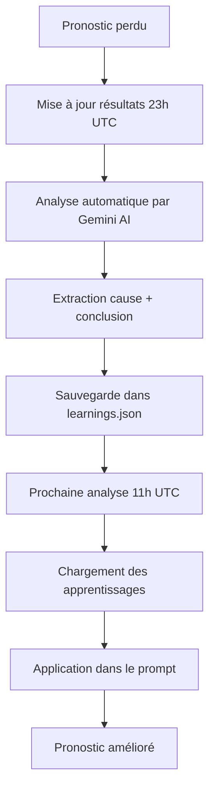

# 🧠 Système d'apprentissage automatique

Le système d'apprentissage analyse automatiquement chaque pronostic perdu pour identifier les causes d'erreur et améliorer les futures prédictions.

## 📊 Comment ça fonctionne ?

### 1. Analyse automatique des erreurs

Chaque jour à **23h UTC**, après la mise à jour des résultats :

1. **Détection** : Le système identifie tous les pronostics perdus
2. **Analyse IA** : Gemini AI analyse chaque erreur pour comprendre pourquoi le pronostic était incorrect
3. **Catégorisation** : Chaque erreur est classée dans une catégorie :
   - `absence_joueur` : Impact d'absence non correctement évalué
   - `forme_recente` : Mauvaise appréciation de la forme récente
   - `contexte_match` : Contexte du match (enjeu, motivation) ignoré
   - `statistiques_trompeuses` : Stats utilisées de manière trompeuse
   - `surestimation_favori` : Favori surestimé
   - `sous_estimation_outsider` : Outsider sous-estimé
   - `autre` : Autre cause

4. **Extraction de conclusions** : Pour chaque erreur, l'IA génère :
   - **Cause principale** : Ce qui a été mal évalué
   - **Facteurs manqués** : Éléments qui auraient dû être pris en compte
   - **Conclusion actionnable** : Règle à appliquer pour éviter l'erreur à l'avenir

### 2. Stockage des apprentissages

Les analyses sont sauvegardées dans deux fichiers :

- **`data/error_analysis.json`** : Détail complet de chaque erreur analysée
- **`data/learnings.json`** : Synthèse des apprentissages et statistiques

Structure de `learnings.json` :
```json
{
  "total_errors_analyzed": 15,
  "last_updated": "2025-01-24T10:30:00",
  "categories": {
    "forme_recente": {
      "count": 5,
      "examples": [...]
    },
    "absence_joueur": {
      "count": 3,
      "examples": [...]
    }
  },
  "key_learnings": [
    {
      "date": "2025-01-24",
      "category": "forme_recente",
      "conclusion": "Ne jamais parier sur une équipe avec 3 défaites consécutives, même à domicile"
    }
  ]
}
```

### 3. Application aux futurs pronostics

À chaque analyse quotidienne (11h UTC), le système :

1. **Charge les apprentissages** depuis `learnings.json`
2. **Injecte dans le prompt** les conclusions les plus récentes
3. **Gemini AI applique ces règles** lors de l'analyse des matchs

Exemple de contexte ajouté au prompt :
```
## ⚠️ APPRENTISSAGES DES ERREURS PASSÉES

15 erreurs analysées - Applique ces conclusions pour éviter les mêmes erreurs.

### Principales causes d'erreurs:
- Forme Récente (5 fois)
  → Ne jamais parier sur une équipe avec 3 défaites consécutives
- Absence Joueur (3 fois)
  → Vérifier l'impact réel de l'absence sur le système de jeu

### ⚡ Règles à appliquer MAINTENANT:
- Ne pas sous-estimer une équipe en déplacement avec 5 victoires sur 7
- Prendre en compte la fatigue après un match européen en milieu de semaine
- Vérifier si le joueur absent est remplaçable ou non dans le système
```

## 🎯 Dashboard "Analyses d'erreurs"

Le dashboard contient un onglet dédié aux analyses d'erreurs avec :

### Vue d'ensemble
- Nombre total d'erreurs analysées
- Principale catégorie d'erreur
- Nombre d'apprentissages actifs

### Distribution des erreurs
- Graphique en camembert des catégories d'erreurs
- Visualisation des tendances

### Apprentissages clés
- Liste des 10 dernières conclusions actionnables
- Catégorie de chaque apprentissage
- Date d'ajout

### Détail des erreurs
- **Filtres** : Par catégorie et par compétition
- **Cards détaillées** pour chaque erreur :
  - Match concerné
  - Score final
  - Type de pari effectué
  - Cause principale de l'erreur
  - Facteurs manqués
  - Conclusion actionnable

## 🔄 Workflow automatique



## 🚀 Utilisation manuelle

### Analyser les erreurs existantes

Pour analyser manuellement tous les pronostics perdus :

```bash
python3 src/post_match_analyzer.py
```

Le script va :
1. Parcourir tous les fichiers de prédictions dans `data/predictions/`
2. Identifier les pronostics avec `result: "lost"`
3. Analyser chaque erreur avec Gemini AI
4. Sauvegarder les analyses et apprentissages

### Consulter les apprentissages

```bash
# Voir le résumé des apprentissages
cat data/learnings.json | python3 -m json.tool

# Voir toutes les analyses détaillées
cat data/error_analysis.json | python3 -m json.tool
```

## 📈 Amélioration continue

Le système s'améliore automatiquement au fil du temps :

1. **Plus de données** → Plus d'erreurs analysées
2. **Plus d'apprentissages** → Règles plus précises
3. **Meilleure performance** → Taux de réussite augmente

Après **20-30 erreurs analysées**, le système aura identifié les patterns récurrents et pourra les éviter efficacement.

## 🎯 Exemple concret

### Erreur détectée
```json
{
  "match": "Bayern Munich vs Augsburg",
  "bet_type": "1X2",
  "bet_choice": "1 (Victoire Bayern)",
  "final_score": "2-2",
  "result": "lost"
}
```

### Analyse par l'IA
```json
{
  "main_cause": "Sous-estimation de l'impact de la fatigue après un match de Champions League en milieu de semaine",
  "missed_factors": [
    "Bayern a joué un match intense à Paris 3 jours avant",
    "Rotation limitée : 8 titulaires identiques",
    "Augsburg au repos complet depuis 7 jours"
  ],
  "actionable_conclusion": "Éviter de parier sur une victoire favorite après un match européen exigeant si moins de 4 jours de repos",
  "error_category": "contexte_match"
}
```

### Application future

La prochaine fois que le système analysera un match similaire (favori après Champions League), le prompt contiendra :

> ⚠️ **Règle apprise** : Éviter de parier sur une victoire favorite après un match européen exigeant si moins de 4 jours de repos

Et Gemini AI évitera cette erreur ou ajustera sa confiance en conséquence.

## 🔧 Configuration

Le système d'apprentissage est **automatiquement activé** dans le workflow GitHub Actions.

Pour désactiver temporairement :
1. Commenter la step "Analyze lost predictions" dans `.github/workflows/update_results.yml`
2. L'analyse manuelle restera possible avec `python3 src/post_match_analyzer.py`

## 📊 Fichiers créés

- **`src/post_match_analyzer.py`** : Module d'analyse des erreurs
- **`data/error_analysis.json`** : Détails de toutes les erreurs
- **`data/learnings.json`** : Synthèse des apprentissages
- **`dashboard.py`** : Onglet "Analyses d'erreurs" ajouté

## ✅ Workflow mis à jour

- **`.github/workflows/update_results.yml`** : Step "Analyze lost predictions" ajoutée
- **`src/gemini_analyzer.py`** : Méthode `_load_learnings()` pour charger les apprentissages

---

**Le système apprend de chaque erreur pour ne plus la refaire. Plus il analyse d'erreurs, plus il devient précis.** 🚀
